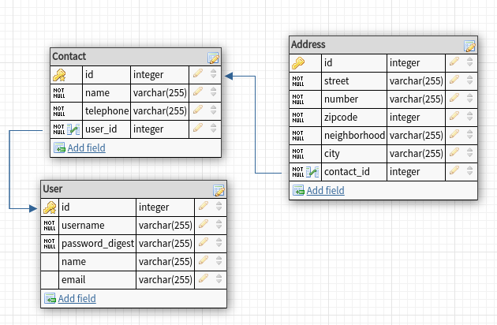

# Contacts-API

A simple project using [Rails](https://rubyonrails.org/) to implement some tests. In this project is possible see tests in models, controllers (requests) and serializers.

The project ERM (Entity Relational Model) is as shown in the image below.



## Setup

### Prerequisites

1 - Ruby

To install Ruby, I recommended use [rbenv](https://github.com/rbenv/rbenv#installation). Just follow the instructions in link.

2 - Postgres

To install Postgres, I recommended use [Docker](https://hub.docker.com/_/postgres). This link is the official image of the Postgres. 

### Dependencies

1 - Install all dependencies of the project

```shell
bundle install
```

2 - Initialize and run migrates in database

```shell
rails db:create & rails db:migrate
```

_Obs: Don't forget to go up your database before run the command above_

## Tests

All the tests uses the [FactoryBot](https://github.com/thoughtbot/factory_bot_rails) to control the base of the tests and [FFaker](https://github.com/ffaker/ffaker) to generate some datas

To run all tests in project, simple run:

```shell
rspec
```
